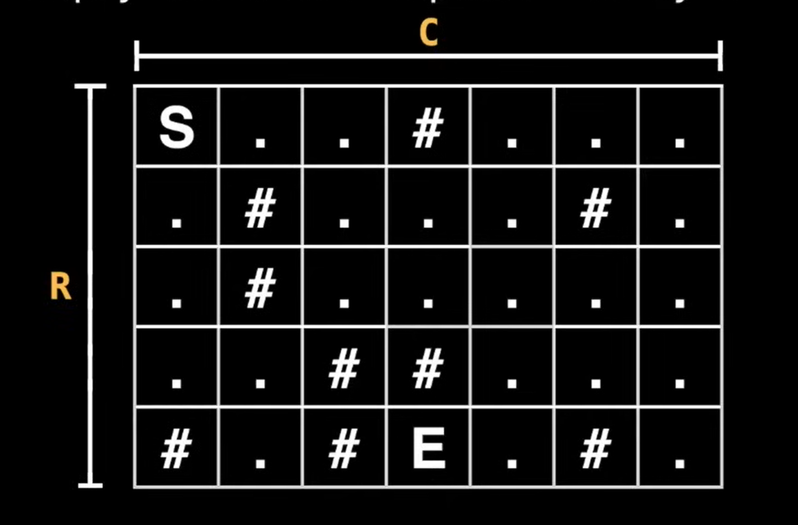
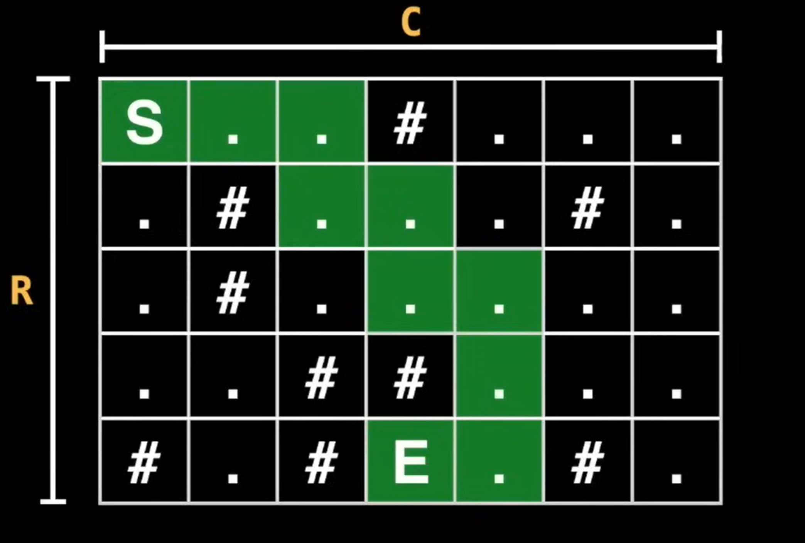

# Dungeon Problem

## Problem Statement

<blockquote>
The dungeon has a size of R X C and you start at cell 'S' and there's an exit
at cell 'E'. A cell full of rock is indicated by a '#' and empty cells are
represented by a '.'

Find the <em>Shortest Path Possible</em> between the starting point 'S' and the
exit point 'E'.
</blockquote>

## Solution

